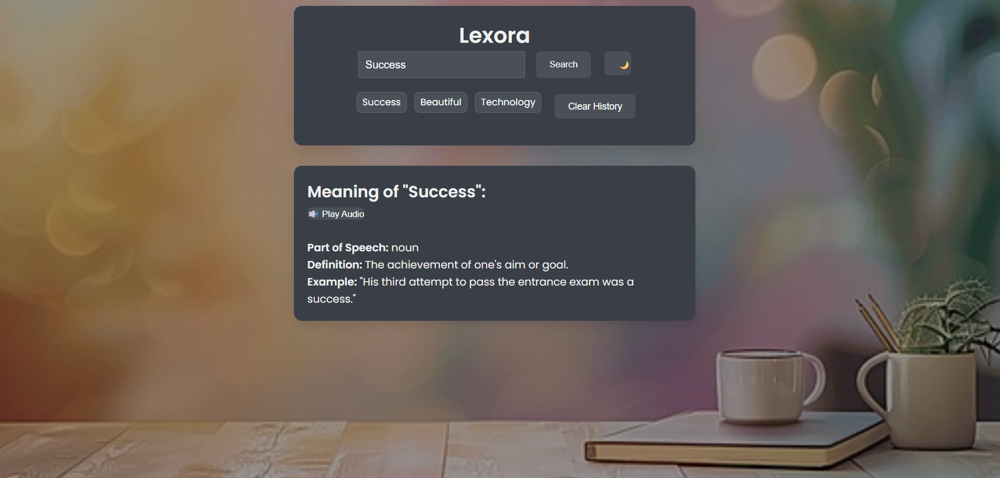

# 📘 Lexora — Smart Dictionary Web App

**Lexora** is an interactive and modern dictionary web application built using **HTML, CSS, and JavaScript**.  
It allows users to search English words and view details like meanings, examples, audio pronunciation, synonyms, and parts of speech — powered by the Free Dictionary API.

Lexora enhances the user experience with **dark mode**, **clickable synonyms**, **search history**, and **local storage** support.

---

## 🚀 Features

✔ Real-time dictionary lookup (Free Dictionary API)  
✔ Displays:  
- Meaning  
- Part of Speech  
- Example  
- Synonyms *(clickable to re-search)*  
- Audio pronunciation  

✔ Dark / Light mode toggle  
✔ Search history (stored in LocalStorage)  
✔ Clear History button  
✔ Press **Enter** to search  
✔ Loading spinner for fetch requests  
✔ Smooth fade-in animations  
✔ Responsive UI across devices  
✔ Clean modern UI with Google Fonts  

---

## 🌐 Live Demo

🔗 **Live Page:** *(add after deployment)*

---

## 🖥 Tech Stack

- **HTML5**
- **CSS3** *(Animations + Dark Mode)*
- **JavaScript (ES6+)**
- **Free Dictionary API**

---

## 📸 Screenshots

### 🔹 Light Mode (Search Result)

### 🔹 Dark Mode (Search Result)

---

## 📁 Project Structure
Lexora/
├── index.html
├── style3.css
├── dictionary.js
├── dictionary-bg.jpg
├── screenshots/
│ ├── light-mode.png
│ └── dark-mode.png
└── README.md
